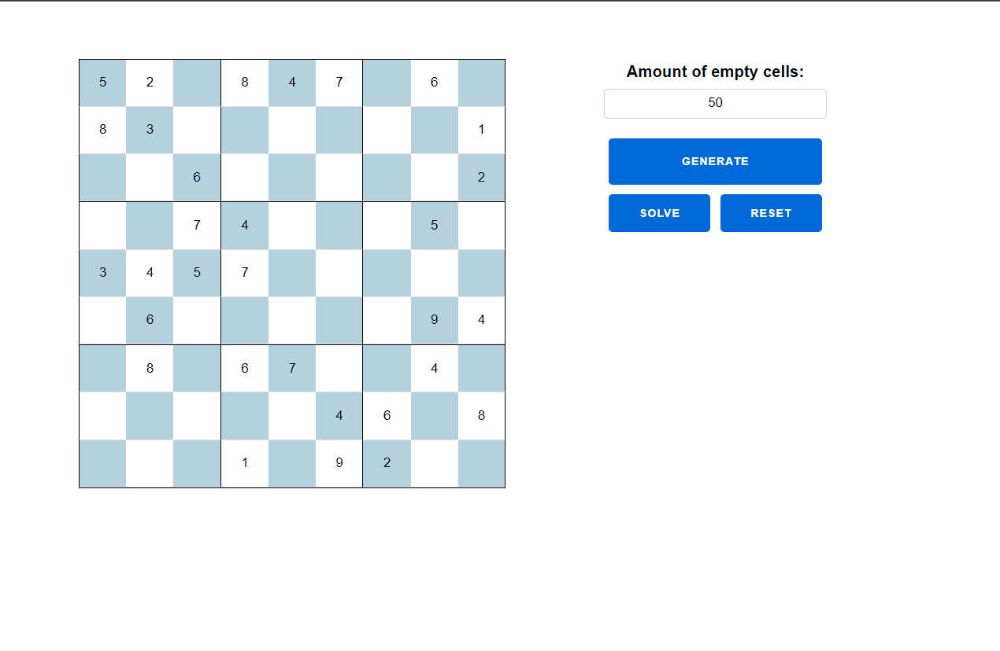

# Sudoku - generator and solver

The application can generate a solvable sudoku board based on the number of blank cells entered by the user.
First, it solves the board by scanning all possible values in each cell, and if any cell has only one possible value, it fills it with that.
It repeats the scan until no such cell is found. Then it solves the board with the given solver.
If a solver is not provided, it uses a backtracking algorithm and a simple solver (it tries to solve the board by randomly selecting one of the available values for each cell).
The algorithm starts 12 parallel tasks - 6 for each solver and after receiving the first result it stops the other tasks and shows the result.

Live demo - https://purple-star-2320.fly.dev/

## Tech
The application was written using basic elixir functions and phoenix live components to represent a sudoku board.

